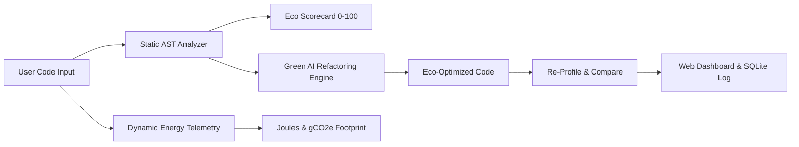

# 🌿 GreenCode AI: Sustainable Code Carbon Footprint & Energy Optimizer

[](https://www.python.org/)
[](https://flask.palletsprojects.org/)
[](LICENSE)
[](#)

> **A practical Green Computing & AI-Augmented Engineering project built for Computer Science & Engineering students.**

---

## 📌 Project Overview
With the global surge in cloud computing, data centers, and AI workloads, software energy consumption and carbon emissions ($CO_2e$) have become critical environmental challenges. **GreenCode AI** provides real-time visibility into code-level power usage and carbon footprint, automatically refactoring energy-inefficient algorithms into carbon-friendly code.

---

## ✨ Key Features
- **🔍 AST Static Eco-Analyzer**: Uses Python's Abstract Syntax Tree (`ast`) parser to detect nested loops ($O(N^2)$), linear list lookups inside loops, unbuffered string concatenations, and uncached exponential recursion.
- **⚡ Dynamic Energy Telemetry**: Executes code in a monitored sandbox to measure execution time ($ms$), memory allocated ($MB$), active CPU power draw ($Watts$), energy consumed ($Joules$), and carbon emissions ($gCO_2e$).
- **🌱 AI-Powered Green Refactoring Engine**: Automatically transforms inefficient algorithms into eco-friendly alternatives with estimated energy savings from **35% to 99%**.
- **📊 Interactive Visual Dashboard**: Modern web interface with side-by-side code refactoring diffs, interactive Chart.js analytics, and downloadable audit reports.
- **🗑️ History Management**: Complete audit history logging with individual record deletion and bulk history clear options.
- **💾 Persistent Audit Logger**: SQLite database storing past eco-audits, total carbon saved counters, and performance benchmarks.
- **🔌 RESTful Pipeline API**: Exposes clean API endpoints for integrating green code audits into CI/CD pipelines.

---

## 🏗️ Architecture & Workflow



---

## 📁 Repository Structure
```
GreenCode-AI/
├── app.py                      # Flask Server & REST API endpoints
├── database.py                 # SQLite persistent database manager
├── core/
│   ├── static_analyzer.py      # AST static energy bug analyzer
│   ├── dynamic_profiler.py     # Execution profiler, Joules & gCO2e calculator
│   └── ai_optimizer.py         # Green code automated refactoring engine
├── templates/
│   └── index.html              # Modern web dashboard interface
├── static/
│   ├── css/style.css           # Glassmorphism green computing styling
│   └── js/app.js               # Frontend UI logic & Chart.js rendering
├── samples/                    # Test script presets (Nested loops, Recursion, etc.)
│   ├── sample_data_processing.py
│   ├── sample_nested_loops.py
│   └── sample_recursion.py
├── tests/
│   └── test_analyzer.py        # Automated PyTest / Unittest suite
├── requirements.txt            # Python dependencies
└── README.md                   # Project documentation
```

---

## 🚀 Quick Start Guide

### 1. Prerequisites
- Python 3.10 or higher installed.

### 2. Installation
Clone the repository and install required packages:
```bash
git clone https://github.com/Yogeshshetty07/GreenCode-AI.git
cd GreenCode-AI
pip install -r requirements.txt
```

### 3. Running the Web Dashboard
Launch the Flask web server:
```bash
python app.py
```
Open your browser and navigate to:
```
http://127.0.0.1:5000
```

### 4. Running Automated Tests
Execute the unit test suite:
```bash
python -m unittest discover -s tests -p "test_*.py"
```

---

## 🔌 API Endpoints

| Method | Endpoint | Description |
| :--- | :--- | :--- |
| `POST` | `/api/analyze` | Accepts `{ "code": "...", "project_name": "..." }` and returns complete eco-audit & refactored code |
| `GET` | `/api/history` | Returns historical eco-audits and total carbon saved statistics |
| `DELETE` | `/api/audit/<id>` | Deletes a specific audit record by ID |
| `DELETE` | `/api/history/clear` | Clears all recorded audit history |
| `GET` | `/api/sample/<name>` | Loads pre-built test code presets (`data_processing`, `nested_loops`, `recursion`) |
| `GET` | `/api/export/<id>` | Generates downloadable Markdown sustainability report for audit record |

---

## 📜 License
This project is open-source under the [MIT License](LICENSE).
